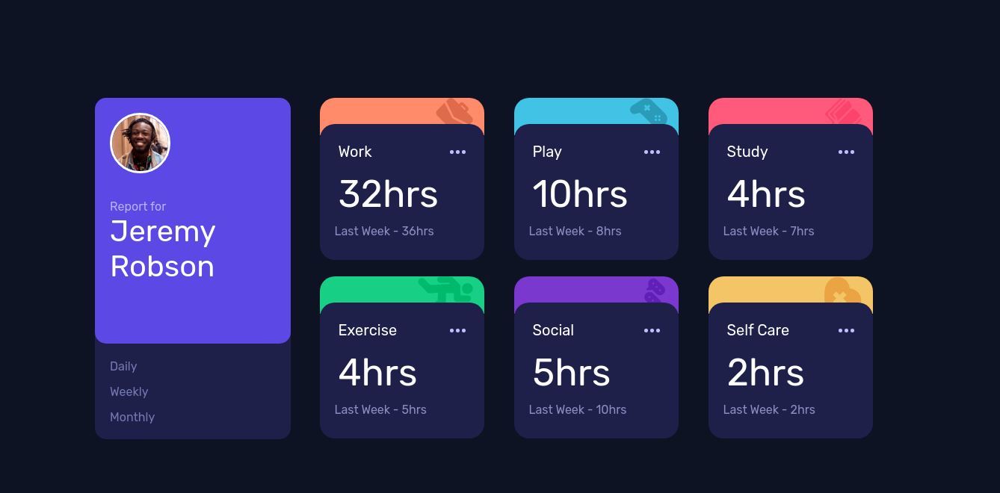

# Frontend Mentor - Time tracking dashboard solution

This is a solution to the [Time tracking dashboard challenge on Frontend Mentor](https://www.frontendmentor.io/challenges/time-tracking-dashboard-UIQ7167Jw). Frontend Mentor challenges help you improve your coding skills by building realistic projects. 

## Table of contents

- [Overview](#overview)
  - [The challenge](#the-challenge)
  - [Screenshot](#screenshot)
  - [Links](#links)
- [My process](#my-process)
  - [Built with](#built-with)
  - [What I learned](#what-i-learned)
  - [Continued development](#continued-development)
  - [Useful resources](#useful-resources)
- [Author](#author)

## Overview

### The challenge

Users should be able to:

- View the optimal layout for the site depending on their device's screen size
- See hover states for all interactive elements on the page
- Switch between viewing Daily, Weekly, and Monthly stats

### Screenshot

#### Desktop:



Still developing mobile version...

### Links

- Solution URL: [Add solution URL here](https://your-solution-url.com)
- Live Site URL: [Add live site URL here](https://your-live-site-url.com)

## My process

### Built with

- Semantic HTML5 markup
- CSS custom properties
- Flexbox
- [Vue.js](https://v3.vuejs.org/) - JS Framework
- [Sass](https://sass-lang.com/) - For styles

### What I learned

How to use position relative on a parent component, and position absolute on it's children components to overlap a few parts of a div. Using ```z-index``` I was able to set which component would be on top. It was a little bit tricky because when dealing with position absolute you have to adjust things like width and height manually with CSS properties like top, right, left and bottom. On the snippet below, `.profile1` stayed on top. 

```css
.profile {
  position: relative;
}
.profile1 {
  position: absolute;
  z-index: 2;
  ...
}
.profile2 {
  position: absolute;
  z-index: 1;
  top: 310px;
  ...
}
```

### Continued development

I still need to fully understand how the `position: absolute` tag works, and try to dive deeper on Vue state management. I will take a look on Vuex in the future. Sass proved to be a great tool & very simple to understand and apply, so I want to keep using it on future projects.

### Useful resources

- [CSS - Display & Position](https://stackoverflow.com/questions/32009050/how-to-wrap-div-within-absolute-position-elements) - When I started to build the profile component at the left, I figured out I had to overlap 2 div tags so I could "draw" a border radius from the first div on the second.
- [JS - Vue Components](https://vuejs.org/v2/guide/components.html) - As I'm learning Vue, the main thing for me was to show different time reports based on day, week and month. I created a new component to show the activity boards (work, play, study...) on a for loop, then I stored the current timeframe on a variable on the main component. 

## Author

- Frontend Mentor - [@rodrigodz1](https://www.frontendmentor.io/profile/rodrigodz1)
- Twitter - [@rodrigodz0](https://twitter.com/rodrigodz0)
